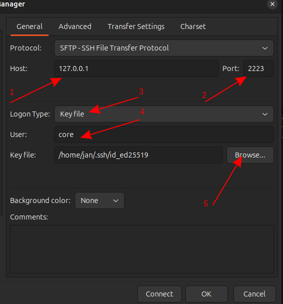

<div style="text-align: center">

![Flatcar OS](https://img.shields.io/badge/Flatcar-App-blue?logo=data:image/svg+xml;base64,PD94bWwgdmVyc2lvbj0iMS4wIiBlbmNvZGluZz0idXRmLTgiPz4NCjwhLS0gR2VuZXJhdG9yOiBBZG9iZSBJbGx1c3RyYXRvciAyNi4wLjMsIFNWRyBFeHBvcnQgUGx1Zy1JbiAuIFNWRyBWZXJzaW9uOiA2LjAwIEJ1aWxkIDApICAtLT4NCjxzdmcgdmVyc2lvbj0iMS4wIiBpZD0ia2F0bWFuXzEiIHhtbG5zPSJodHRwOi8vd3d3LnczLm9yZy8yMDAwL3N2ZyIgeG1sbnM6eGxpbms9Imh0dHA6Ly93d3cudzMub3JnLzE5OTkveGxpbmsiIHg9IjBweCIgeT0iMHB4Ig0KCSB2aWV3Qm94PSIwIDAgODAwIDYwMCIgc3R5bGU9ImVuYWJsZS1iYWNrZ3JvdW5kOm5ldyAwIDAgODAwIDYwMDsiIHhtbDpzcGFjZT0icHJlc2VydmUiPg0KPHN0eWxlIHR5cGU9InRleHQvY3NzIj4NCgkuc3Qwe2ZpbGw6IzA5QkFDODt9DQo8L3N0eWxlPg0KPHBhdGggY2xhc3M9InN0MCIgZD0iTTQ0MCwxODIuOGgtMTUuOXYxNS45SDQ0MFYxODIuOHoiLz4NCjxwYXRoIGNsYXNzPSJzdDAiIGQ9Ik00MDAuNSwzMTcuOWgtMzEuOXYxNS45aDMxLjlWMzE3Ljl6Ii8+DQo8cGF0aCBjbGFzcz0ic3QwIiBkPSJNNTQzLjgsMzE3LjlINTEydjE1LjloMzEuOVYzMTcuOXoiLz4NCjxwYXRoIGNsYXNzPSJzdDAiIGQ9Ik02NTUuMiw0MjAuOXYtOTUuNGgtMTUuOXY5NS40aC0xNS45VjI2MmgtMzEuOVYxMzQuOEgyMDkuNFYyNjJoLTMxLjl2MTU5aC0xNS45di05NS40aC0xNnY5NS40aC0xNS45djMxLjINCgloMzEuOXYxNS44aDQ3Ljh2LTE1LjhoMTUuOXYxNS44SDI3M3YtMTUuOGgyNTQuOHYxNS44aDQ3Ljh2LTE1LjhoMTUuOXYxNS44aDQ3Ljh2LTE1LjhoMzEuOXYtMzEuMkg2NTUuMnogTTQ4Ny44LDE1MWg3OS42djMxLjgNCgloLTIzLjZ2NjMuNkg1MTJ2LTYzLjZoLTI0LjJMNDg3LjgsMTUxTDQ4Ny44LDE1MXogTTIzMywyMTQuNlYxNTFoNjMuN3YyMy41aC0zMS45djE1LjhoMzEuOXYyNC4yaC0zMS45djMxLjhIMjMzVjIxNC42eiBNMzA1LDMxNy45DQoJdjE1LjhoLTQ3Ljh2MzEuOEgzMDV2NDcuN2gtOTUuNVYyODYuMUgzMDVMMzA1LDMxNy45eiBNMzEyLjYsMjQ2LjRWMTUxaDMxLjl2NjMuNmgzMS45djMxLjhMMzEyLjYsMjQ2LjRMMzEyLjYsMjQ2LjRMMzEyLjYsMjQ2LjR6DQoJIE00NDguMywzMTcuOXY5NS40aC00Ny44di00Ny43aC0zMS45djQ3LjdoLTQ3LjhWMzAyaDE1Ljl2LTE1LjhoOTUuNVYzMDJoMTUuOUw0NDguMywzMTcuOXogTTQ0MCwyNDYuNHYtMzEuOGgtMTUuOXYzMS44aC0zMS45DQoJdi03OS41aDE1Ljl2LTE1LjhoNDcuOHYxNS44aDE1Ljl2NzkuNUg0NDB6IE01OTEuNiwzMTcuOXY0Ny43aC0xNS45djE1LjhoMTUuOXYzMS44aC00Ny44di0zMS43SDUyOHYtMTUuOGgtMTUuOXY0Ny43aC00Ny44VjI4Ni4xDQoJaDEyNy4zVjMxNy45eiIvPg0KPC9zdmc+DQo=)
[![Flatcar OS](https://img.shields.io/badge/Flatcar-Website-blue?logo=data:image/svg+xml;base64,PD94bWwgdmVyc2lvbj0iMS4wIiBlbmNvZGluZz0idXRmLTgiPz4NCjwhLS0gR2VuZXJhdG9yOiBBZG9iZSBJbGx1c3RyYXRvciAyNi4wLjMsIFNWRyBFeHBvcnQgUGx1Zy1JbiAuIFNWRyBWZXJzaW9uOiA2LjAwIEJ1aWxkIDApICAtLT4NCjxzdmcgdmVyc2lvbj0iMS4wIiBpZD0ia2F0bWFuXzEiIHhtbG5zPSJodHRwOi8vd3d3LnczLm9yZy8yMDAwL3N2ZyIgeG1sbnM6eGxpbms9Imh0dHA6Ly93d3cudzMub3JnLzE5OTkveGxpbmsiIHg9IjBweCIgeT0iMHB4Ig0KCSB2aWV3Qm94PSIwIDAgODAwIDYwMCIgc3R5bGU9ImVuYWJsZS1iYWNrZ3JvdW5kOm5ldyAwIDAgODAwIDYwMDsiIHhtbDpzcGFjZT0icHJlc2VydmUiPg0KPHN0eWxlIHR5cGU9InRleHQvY3NzIj4NCgkuc3Qwe2ZpbGw6IzA5QkFDODt9DQo8L3N0eWxlPg0KPHBhdGggY2xhc3M9InN0MCIgZD0iTTQ0MCwxODIuOGgtMTUuOXYxNS45SDQ0MFYxODIuOHoiLz4NCjxwYXRoIGNsYXNzPSJzdDAiIGQ9Ik00MDAuNSwzMTcuOWgtMzEuOXYxNS45aDMxLjlWMzE3Ljl6Ii8+DQo8cGF0aCBjbGFzcz0ic3QwIiBkPSJNNTQzLjgsMzE3LjlINTEydjE1LjloMzEuOVYzMTcuOXoiLz4NCjxwYXRoIGNsYXNzPSJzdDAiIGQ9Ik02NTUuMiw0MjAuOXYtOTUuNGgtMTUuOXY5NS40aC0xNS45VjI2MmgtMzEuOVYxMzQuOEgyMDkuNFYyNjJoLTMxLjl2MTU5aC0xNS45di05NS40aC0xNnY5NS40aC0xNS45djMxLjINCgloMzEuOXYxNS44aDQ3Ljh2LTE1LjhoMTUuOXYxNS44SDI3M3YtMTUuOGgyNTQuOHYxNS44aDQ3Ljh2LTE1LjhoMTUuOXYxNS44aDQ3Ljh2LTE1LjhoMzEuOXYtMzEuMkg2NTUuMnogTTQ4Ny44LDE1MWg3OS42djMxLjgNCgloLTIzLjZ2NjMuNkg1MTJ2LTYzLjZoLTI0LjJMNDg3LjgsMTUxTDQ4Ny44LDE1MXogTTIzMywyMTQuNlYxNTFoNjMuN3YyMy41aC0zMS45djE1LjhoMzEuOXYyNC4yaC0zMS45djMxLjhIMjMzVjIxNC42eiBNMzA1LDMxNy45DQoJdjE1LjhoLTQ3Ljh2MzEuOEgzMDV2NDcuN2gtOTUuNVYyODYuMUgzMDVMMzA1LDMxNy45eiBNMzEyLjYsMjQ2LjRWMTUxaDMxLjl2NjMuNmgzMS45djMxLjhMMzEyLjYsMjQ2LjRMMzEyLjYsMjQ2LjRMMzEyLjYsMjQ2LjR6DQoJIE00NDguMywzMTcuOXY5NS40aC00Ny44di00Ny43aC0zMS45djQ3LjdoLTQ3LjhWMzAyaDE1Ljl2LTE1LjhoOTUuNVYzMDJoMTUuOUw0NDguMywzMTcuOXogTTQ0MCwyNDYuNHYtMzEuOGgtMTUuOXYzMS44aC0zMS45DQoJdi03OS41aDE1Ljl2LTE1LjhoNDcuOHYxNS44aDE1Ljl2NzkuNUg0NDB6IE01OTEuNiwzMTcuOXY0Ny43aC0xNS45djE1LjhoMTUuOXYzMS44aC00Ny44di0zMS43SDUyOHYtMTUuOGgtMTUuOXY0Ny43aC00Ny44VjI4Ni4xDQoJaDEyNy4zVjMxNy45eiIvPg0KPC9zdmc+DQo=)](https://www.flatcar.org/)
[](https://app.element.io/#/room/#flatcar:matrix.org)
[](https://kubernetes.slack.com/archives/C03GQ8B5XNJ)
[](https://x.com/flatcar)
[](https://hachyderm.io/@flatcar)
[](https://bsky.app/profile/flatcar.org)

</div>


# Flatcar Minecraft Server

<div style="text-align: center">
  
</div>

> **A lightweight, containerized PaperMC setup on [Flatcar Container Linux](https://www.flatcar.org/).**
> **Easily deployable on Azure or any other cloud/provider.**

## TL;DR:
This project sets up a lightweight, containerized Minecraft server using PaperMC on Flatcar Container Linux. It leverages Docker and systemd to run the server with configurable environment variables (for Java memory, garbage collection, RCON, etc.) and includes an optional SFTP service for easy file transfers. The guide provides step-by-step instructions for both local deployments using QEMU (with port forwarding for Minecraft, RCON, and SFTP) and cloud deployments on Azure (covering resource groups, VNet, SSH keys, and opening necessary ports). This container-first approach simplifies updates, rollbacks, and scalability while ensuring a secure, minimal OS footprint.


## Table of Contents 📚

- [Flatcar Minecraft Server](#flatcar-minecraft-server)
  - [TL;DR:](#tldr)
  - [Table of Contents 📚](#table-of-contents-)
  - [Introduction \& Purpose 🌟](#introduction--purpose-)
  - [A Flatcar Container Linux project](#a-flatcar-container-linux-project)
    - [Why Flatcar?](#why-flatcar)
    - [Why Containers for Minecraft?](#why-containers-for-minecraft)
  - [Prerequisites \& Requirements 🛠️](#prerequisites--requirements-️)
    - [Notes on Firewalls \& Security](#notes-on-firewalls--security)
  - [Overview of Steps 📝](#overview-of-steps-)
    - [3.1 Environment Variables \& Java Settings](#31-environment-variables--java-settings)
      - [Common Env Vars:](#common-env-vars)
    - [3.2 Detailed Java/G1GC Settings](#32-detailed-javag1gc-settings)
    - [3.3 SFTP Service Explanation](#33-sftp-service-explanation)
  - [Summary of `config.yaml` Contents 📄](#summary-of-configyaml-contents-)
  - [Example: Running Flatcar Locally with QEMU 🕹️](#example-running-flatcar-locally-with-qemu-️)
    - [5.1 Download the Flatcar QEMU Image](#51-download-the-flatcar-qemu-image)
    - [5.2 Prepare Your Ignition (Butane) Config](#52-prepare-your-ignition-butane-config)
    - [5.3 Launch QEMU with Port Forwarding](#53-launch-qemu-with-port-forwarding)
    - [5.4 Watch Flatcar Boot \& Docker Start](#54-watch-flatcar-boot--docker-start)
    - [5.5 Interacting with Your Minecraft Server](#55-interacting-with-your-minecraft-server)
    - [Additional Reading \& Tips](#additional-reading--tips)
  - [Example: Deploying on Azure Cloud ☁️](#example-deploying-on-azure-cloud-️)
    - [6.1 Connect to Azure \& Understand the Cloud Shell](#61-connect-to-azure--understand-the-cloud-shell)
    - [6.2 Accept the Flatcar Image Terms](#62-accept-the-flatcar-image-terms)
    - [6.3 Set Variables](#63-set-variables)
      - [Picking a VM Size \& Understanding Azure Pricing](#picking-a-vm-size--understanding-azure-pricing)
    - [6.4 Create an Azure Resource Group](#64-create-an-azure-resource-group)
    - [6.5 Create a Virtual Network \& Subnet](#65-create-a-virtual-network--subnet)
    - [6.6 Prepare the Ignition File (Using Butane)](#66-prepare-the-ignition-file-using-butane)
    - [6.7 Deploy the Flatcar VM](#67-deploy-the-flatcar-vm)
    - [6.8 Open Ports for Minecraft](#68-open-ports-for-minecraft)
      - [Security Tip](#security-tip)
    - [6.9 SSH into Your VM \& Check Services](#69-ssh-into-your-vm--check-services)
    - [6.10 Connecting to RCON](#610-connecting-to-rcon)
    - [6.11 Connecting via SFTP](#611-connecting-via-sftp)
    - [That’s It!](#thats-it)

---

## Introduction & Purpose 🌟

Welcome to the **Flatcar Minecraft Server** project! This repository demonstrates how to run a [PaperMC](https://papermc.io/) server on [Flatcar Container Linux](https://www.flatcar.org/), a lightweight, immutable OS designed specifically for containerized applications.

If you're new to Flatcar, we highly recommend exploring the [Flatcar Homepage](https://www.flatcar.org/) for detailed information on features, installation guides, and best practices. The [Flatcar Documentation](https://www.flatcar.org/docs/latest/) is also an excellent resource to help you get started with deploying and managing Flatcar instances.

Flatcar Container Linux is built with a container-first approach, ensuring that you have an environment optimized for running Docker (or containerd) workloads securely. Whether you're running Minecraft for fun or setting up a production game server, this guide provides you with all the necessary steps to get your server up and running smoothly.

## A Flatcar Container Linux project

Flatcar Container Linux is a fully open source, minimal-footprint, secure by default and always up-to-date Linux distribution for running containers at scale.

This repository is maintained by the Flatcar community and contributors. Development and design decisions are guided by the principles of transparency, modularity, and collaboration.

Please find information on:

- [Contribution Guide](https://github.com/flatcar/Flatcar/blob/main/CONTRIBUTING.md) – how to get involved and submit patches.
- [Repository Codeowners](./CODEOWNERS) – who's assigned for contribution reviews in this repository.
- [Repository Maintainers](./MAINTAINERS.md) – who’s responsible for what in this repository.
- [Flatcar Project Maintainers](https://github.com/flatcar/Flatcar/blob/main/MAINTAINERS.md) – who’s responsible for what at Flatcar.
- [Governance](https://github.com/flatcar/Flatcar/blob/main/governance.md) – how decisions are made and who the stakeholders are.
- [Code of Conduct](./code-of-conduct.md) – our commitment to a welcoming and inclusive community.
- [LICENSE](./LICENSE) - License under which the software is released.


### Why Flatcar?

- **Immutable & Lightweight**: Flatcar is designed with container workloads in mind, providing a minimal, read-only root filesystem and automated updates.
- **Secure & Stable**: Its auto-update mechanism and minimal package footprint reduce attack vectors, meaning fewer maintenance headaches for your Minecraft server.
- **Container-First Approach**: Docker (or containerd) is built-in, so you can manage your Minecraft server as a portable container image.

### Why Containers for Minecraft?

- **Easy Upgrades & Rollbacks**: Want to update your server or switch to a different version? Just pull a new container image.
- **Separation of Concerns**: You don’t have to worry about installing Java or other system dependencies directly on the host.
- **Scalability**: Spin up additional containers on other Flatcar instances if you need more capacity or want a test environment.


---

<p style="text-align: center">
  <em>Ready to launch your PaperMC server on Flatcar? Let’s dive in!</em>
</p>


## Prerequisites & Requirements 🛠️

Although our walkthrough includes locally hosted as well as **Azure Cloud** hosted examples, you can adapt these steps to **any platform** that supports [Flatcar Container Linux](https://www.flatcar.org/). Here’s what you’ll need:

- **Flatcar-Ready Environment**
  Any server or virtual machine running a Flatcar image, or the ability to create one (via Azure, AWS, your own hypervisor, etc.). If you are going to host it locally, please reffer to the [Flatcar tutorial](https://www.flatcar.org/docs/latest/tutorial/) that details what you will need as well as how to use.

- **SSH Keys**
  Flatcar uses the `core` user with no default password, so you’ll typically log in with SSH keys. Make sure you have a key pair ready.

- **Butane** *(optional but recommended)*
  If you plan to **locally** generate your Ignition file from the Butane YAML, you’ll need the [Butane CLI](https://coreos.github.io/butane/) or Docker image ([how to install docker](https://docs.docker.com/engine/install/)). If you prefer, you can also write or edit the Ignition config directly.

- **Basic Container & CLI Knowledge**
  Because we’re containerizing Minecraft, knowing some Docker basics-like pulling images, viewing logs, or stopping containers, will help troubleshoot any issues.

### Notes on Firewalls & Security
- This example does **not** automatically configure OS-level firewalls beyond what Azure (or your cloud provider) might offer. Make sure to open or secure ports if you’re using another environment.
- Always safeguard your SSH keys and RCON passwords.


## Overview of Steps 📝

Below is a **high-level** outline of how you’ll set up and run your Minecraft server using Flatcar. Each step can be adjusted based on where you’re hosting (Azure, local VM, etc.). We will show you two examples of doing that, both locally and later on Azure:

1. **Set or Adjust Environment Variables**
   Decide on your Minecraft version, memory limits, RCON settings, and Java flags (GC tuning). These variables live in the Butane config-or can be edited later on the VM.

2. **Generate (or Obtain) the Final Ignition File**
   Using [Butane](https://coreos.github.io/butane/), convert the YAML config into an Ignition file (`config.ign`) that Flatcar understands.

3. **Deploy Your Flatcar Instance**
   Launch a new Flatcar machine-on Azure, AWS, or locally, and provide the Ignition file as “custom data” (or “user data”).

4. **Open Ports / Configure Networking**
   Ensure Minecraft (25565), RCON (25575), and SFTP (2223) are accessible if you’re hosting publicly. On Azure, this means adding inbound security rules. On a local environment, you might modify your firewall or router.

5. **Verify & Manage Services**
   SSH into the box (`ssh core@...`) to check `minecraft.service` and (optionally) `sshd-sftp.service`. Tail logs, tweak environment variables, and restart if needed.

### 3.1 Environment Variables & Java Settings

Running a Minecraft server on Flatcar requires a few key **environment variables** that tell the server (and Docker) how to behave. In this setup, you directly control the memory and Java tuning settings through the variables in `papermc.env` that is defined first in `config.yaml` and later after deployment will be in `/etc/systemd/system/papermc.env`.

#### Common Env Vars:

- **EULA=true**
  Confirms you accept the Minecraft End User License Agreement. Without `true`, the server won’t start.

- **MC_VERSION / PAPER_BUILD**
  Controls which Paper build is used (e.g., `latest` for the newest version, or a specific tag like `1.20.1`).

- **DOCKER_RAM**
  Sets how much memory the docker container can use. This should be set slightly lower than the total memory of your host system to allow system overhead.

- **MC_RAM**
  Sets how much memory the Java process can use. This should be set slightly lower than the total container memory (`DOCKER_RAM`) to allow system overhead.

- **JAVA_OPTS**
  Java flags that control heap size, garbage collection tuning, and other performance-related parameters.

- **ENABLE_RCON / RCON_PASSWORD / RCON_PORT**
  Enables the Minecraft server’s remote console. Set a strong password and open the port if you need external admin tools.

An example of how you could structure memory usage across your host, container and minecrafts Java process would be:
 - The host has `8G` of RAM
 - `7G` could be given to the docker container
 - `6G` could be given to the java process running inside the container

Thus making `DOCKER_RAM=7G` and `MC_RAM=6G`. This would certainly allow for some system overhead, however remember that every setup, hardware, cloud provider and configuration might be a bit different in terms of perfomance. So make sure you test out your memory configuration and playround/tweak it a bit so that it works on your setup.

For fine-tuning Java performance, you can modify `JAVA_OPTS` with recommended flags or your own settings.
For an exact set of recommended flags (or if you have special requirements), visit PaperMC’s own [Start Script Generator](https://docs.papermc.io/misc/tools/start-script-gen). Just remember there is **no one-size-fits-all** solution-monitor your server and adjust.

> More on [monitoring/profiling](https://docs.papermc.io/paper/profiling) and [toubleshooting](https://docs.papermc.io/paper/basic-troubleshooting).


You can apply the change of these variables in **two main ways**:

1. **Before Provisioning**
   Edit the Butane config that sets up your server. This is ideal if you haven’t deployed yet, since the values will be “baked in” from the start.

2. **After Provisioning**
   If your server is already running, you can edit the `/etc/systemd/system/minecraft.service` or `/etc/systemd/system/papermc.env` file on the VM itself. And after modifying it, run:

```bash
   sudo systemctl daemon-reload
   sudo systemctl restart minecraft.service
```

This reloads the updated environment settings and restarts the server with them.


### 3.2 Detailed Java/G1GC Settings

Minecraft uses Java under the hood. By default, Java’s garbage collector might not be fully optimized for a busy server. Many players (and the PaperMC project) recommend **Aikar’s Flags**, a collection of GC tweaks that keep performance smoother.

Here’s a quick explanation of some commonly mentioned flags:

- **-Xms / -Xmx**
  Minimum (-Xms) and maximum (-Xmx) memory for Java. Example: -Xms4G -Xmx4G means “Start with 4 GB; don’t exceed 4 GB.”

- **-XX:+UseG1GC**
  Tells Java to use the G1 (“Garbage First”) garbage collector, which generally reduces lag spikes on larger heaps.

- **-XX:G1NewSizePercent / -XX:G1MaxNewSizePercent**
  Controls the “young” generation size within the heap, particularly important for Minecraft’s frequent creation and disposal of short-lived objects.

- **-XX:G1ReservePercent**
  Keeps a buffer of unused memory to avoid running out of space during garbage collection.

- **-XX:SurvivorRatio** and **-XX:MaxTenuringThreshold**
  These manage how objects move (or “promote”) from short-lived memory regions to longer-lived ones, keeping performance stable.

- **-XX:MaxGCPauseMillis**
  A target for maximum pause time during garbage collection. You can tune this if you see frequent or lengthy pauses.

- **-XX:+DisableExplicitGC**
  Prevents plugins or mods from forcing a garbage collection, which can cause sudden lag.

- **-XX:+AlwaysPreTouch**
  Pre-allocates memory on startup so the server doesn’t pause later to expand the heap.

- **-Dusing.aikars.flags / -Daikars.new.flags**
  Just markers indicating these are “Aikar’s recommended” settings.

> Source: [Aikar's Flags: Recommended JVM startup flags](https://docs.papermc.io/paper/aikars-flags)


### 3.3 SFTP Service Explanation

> This is **optional**. If you already have a preferred file-transfer method, skip it!

Besides Minecraft, you may want to **upload or download server files** easily (for example, to add plugins or manage world data). That’s why this setup includes an **SFTP service**:

- It **publishes port 2223** inside the VM, so you can connect from outside.
- We mount the Docker volume papermc-data to /home/core/papermc.
- We use the **Flatcar core user**, which relies on **SSH keys** by default, not passwords.

**Why SFTP?**
- It lets you drag and drop files (world folders, configuration files, etc.) without needing advanced Docker commands or an internal file manager.
- It’s more secure than traditional FTP because it uses SSH encryption.
- It’s separate from your main SSH service on port 22, so you can keep your standard SSH usage distinct from SFTP connections.

**How to Connect**:
Use an SFTP client (e.g., FileZilla, WinSCP, or the sftp command) with your **SSH key** and **port 2223**. For example:
bash
sftp -i ~/.ssh/id_rsa -P 2223 core@<vm-ip>

<!-- TODO more visual helps -->


You’ll see the papermc directory, and you can upload plugins, worlds, or other server files directly.


## Summary of `config.yaml` Contents 📄
This configuration file sets up the Flatcar Minecraft Server by creating three essential files and enabling the necessary systemd units:

1. **/etc/systemd/system/papermc.env**
   - Contains core environment variables such as acceptance of the Minecraft EULA, PaperMC build parameters (MC_VERSION and PAPER_BUILD), memory settings (DOCKER_RAM and MC_RAM), and JVM tuning options via JAVA_OPTS.

2. **/etc/systemd/system/sshd-sftp.service**
   - Defines an SSH-based SFTP service running on port 2223, allowing secure file management (plugins, world data, etc.) via SFTP using your SSH key.

3. **/etc/systemd/system/minecraft.service**
   - Configures the Docker run command that launches the PaperMC server container. This service loads the environment variables from papermc.env, binds ports 25565 (Minecraft) and 25575 (RCON), and mounts the papermc-data volume for persistent storage.

Additionally, the systemd section in `config.yaml` ensures that the following units are enabled at boot:
- `docker.service` (ensures Docker starts at boot).
- `minecraft.service` (the main server).
- `sshd-sftp.service` (the optional SFTP process).

When Flatcar boots, these services **start automatically**, letting you jump right in and connect to your Minecraft server. This structure ensures that all configuration resides in papermc.env, allowing you to directly control the server's performance parameters.


## Example: Running Flatcar Locally with QEMU 🕹️

If you prefer a **local** setup on your own machine (for testing, development, or just tinkering around), you can run Flatcar Container Linux in a **QEMU** virtual machine. Below is an example workflow. For more details, refer to the [official Flatcar Docs on QEMU](https://www.flatcar.org/docs/latest/provisioning/booting-with-qemu/) - they have more thorough instructions, including different networking and drive configurations.

---

### 5.1 Download the Flatcar QEMU Image

Visit the [Flatcar Download Page](https://www.flatcar.org/releases/) or the [Flatcar Docs](https://www.flatcar.org/docs/latest/) to grab the **QEMU image**. You’ll typically see a file named something like `flatcar_production_qemu_image.img` along with a **helper script** such as `flatcar_production_qemu.sh`.

- Make sure you match the **version** of Flatcar you want (e.g., Stable, Beta, etc.).
- Place these files in a convenient directory on your local machine.

```bash
wget https://stable.release.flatcar-linux.net/amd64-usr/current/flatcar_production_qemu_image.img
```

### 5.2 Prepare Your Ignition (Butane) Config

Just like with Azure (or any other environment), you’ll need an **Ignition** file (`config.ign`) that sets up Docker, systemd units, etc. If you have a **Butane YAML** (e.g., `config.yaml`), convert it to `config.ign`:

Bash:
```bash
docker run --rm -i quay.io/coreos/butane:latest < config.yaml > config.ign
```

Command Prompt on Windows:

```cmd
docker run --rm -i quay.io/coreos/butane:latest < config.yaml > config.ign
```

PowerShell on Windows:

```pwsh
Get-Content -Raw .\config.yaml | docker run --rm -i quay.io/coreos/butane:latest > .\config.ign
```

> **Tip**: If you’re not sure how to create this file, see the previous sections or the [Flatcar Docs](https://www.flatcar.org/docs/latest/provisioning/ignition/) on Ignition. The same **Minecraft** example config can be used locally just as well as in the cloud.

---

### 5.3 Launch QEMU with Port Forwarding

Before launching QEMU, ensure you have downloaded the latest Flatcar QEMU image and helper script from the official Flatcar website. You can obtain these files from the [Flatcar Releases](https://www.flatcar.org/releases/) page or review the [Flatcar Documentation](https://www.flatcar.org/docs/latest/) for detailed instructions.

Follow these steps if you’re new to Flatcar:

1. Download the helper script (`flatcar_production_qemu.sh`) from the git repo using your browser or command-line tools like `wget`.

    ```bash
    wget https://stable.release.flatcar-linux.net/amd64-usr/current/flatcar_production_qemu.sh
    ```

2. Make the helper script executable:
   ```bash
   chmod +x flatcar_production_qemu.sh
   ```


3. Launch QEMU with port forwarding to access your services:
   ```bash
   ./flatcar_production_qemu.sh \
     -M 6144 \            # Allocate 6144 MB RAM to the VM
     -f 25565:25565 \     # Forward Minecraft port (host to guest)
     -f 25575:25575 \     # Forward RCON port (host to guest)
     -f 2223:2223 \       # Forward SFTP port (host to guest)
     -i ./config.ign \    # Provide the Ignition config generated from Butane
     -- -display curses   # Display QEMU output in terminal mode (adjust as needed)
   ```

This command ensures:
- Memory allocation for the Flatcar VM is set per your requirements.
- Ports 25565, 25575, and 2223 are forwarded from your host to the VM, making the Minecraft server, RCON, and SFTP services accessible.
- Your Ignition configuration (`config.ign`) is loaded on first boot to set up Docker, systemd, and other services automatically.

If you're completely new to Flatcar, we highly recommend visiting the [Flatcar Quickstart Guide](https://www.flatcar.org/docs/latest/getting-started/) and exploring the [Flatcar Documentation](https://www.flatcar.org/docs/latest/) for more comprehensive instructions and insights into managing Flatcar Container Linux.

---

### 5.4 Watch Flatcar Boot & Docker Start

When QEMU starts, you’ll see **Flatcar** booting. It will apply your Ignition config to:

- Enable Docker.
- Deploy the **Minecraft** and **SFTP** systemd services (if included).

Once booted:

1. **Log in** with the `core` user (if you set up SSH keys, you may need to log in via the console or set a password in your Ignition).
2. **Check services** (similar to any Flatcar instance):
   ```bash
   sudo systemctl status minecraft.service
   sudo systemctl status sshd-sftp.service
   ```
3. **Test** you can connect to Minecraft by opening your local Minecraft client and connecting to `127.0.0.1:25565` (or `[host IP]:25565` if you’re on the same machine).


---

### 5.5 Interacting with Your Minecraft Server

- **RCON**: If you forwarded port 25575, you can run:
  ```bash
  docker run -it --rm itzg/rcon-cli --host 127.0.0.1 --port 25575 --password $RCON_PASSWORD
  ```
  and issue commands.

- **SFTP**: If you included the `sshd-sftp.service` on port **2223**, you can do:
  ```bash
  sftp -P 2223 core@127.0.0.1
  ```
  and use your SSH key or local console-based authentication (if configured). You’ll see the `/home/core/papermc` directory for uploading mods/plugins.


You can also use a GUI based program like [Filezilla](https://filezilla-project.org/). First create a new connection:


Then fill out the necceserry fields:
  1. In our case because we are running it locally, the `IP` is going to be localhost or simply `127.0.0.1`.
  2. The port for `SFTP` (default is `2223` unless you have changed it)
  3. Select the `Key file` option as Flatcar is passworldless
  4. Select the `core` user
  5. Select the key you downloaded or have locally that can be used to log into the `core` user on your VM

Now you should be able to press `Connect` and connect to the server:



You should see a folder named `papermc`:


This is where all of the game files exist and you can edit/download them or upload new ones etc.:


---

### Additional Reading & Tips

1. **Official Flatcar Docs**:
   - [Running Flatcar with QEMU](https://www.flatcar.org/docs/latest/provisioning/booting-with-qemu/)
   - [Ignition / Butane Usage](https://www.flatcar.org/docs/latest/provisioning/ignition/)

2. **Port Forwarding**:
   If you need more complex networking (e.g., bridging QEMU to your LAN instead of using user-mode forwarding), see the QEMU documentation or the Flatcar docs on advanced networking.

3. **Performance**:
   For best results, ensure your host has enough RAM and CPU to handle both your OS and the QEMU guest.

4. **Dev & Testing**:
   Running Flatcar + Minecraft in QEMU is perfect for **trying out** new Docker images or testing your config changes locally before deploying to a cloud environment.

---

**That’s it!** You’re now hosting your Minecraft server on a local Flatcar VM via QEMU. This approach makes it easy to experiment with different configurations, memory tiers, or plugin setups-all without incurring cloud costs. Have fun building your worlds! 🗺️


## Example: Deploying on Azure Cloud ☁️

Below is an **example** workflow for hosting this Flatcar Minecraft setup on **Microsoft Azure**. If you’re using another platform, you can skip the Azure commands and just launch a Flatcar instance normally with the same Ignition file. However, if you are new to Azure or **cloud computing**, the following explains each step in detail.

---

### 6.1 Connect to Azure & Understand the Cloud Shell

1. **Open Azure Cloud Shell** in your browser, or use the **Azure CLI** locally.
2. **Log in** to Azure:
   ```bash
   az login
   ```
3. **Important**: The Azure Cloud Shell environment is **temporary/ephemeral**. Your files or SSH keys may be lost if the shell is restarted or times out.
   - If you generate new SSH keys in Cloud Shell, be sure to **back them up** locally; otherwise, you **won’t** be able to log into your VM later if the shell resets.

---

### 6.2 Accept the Flatcar Image Terms

Before you can deploy Flatcar from the Azure Marketplace, you need to accept its terms:

```bash
az vm image terms accept \
  --publisher kinvolk \
  --offer flatcar-container-linux-free \
  --plan stable-gen2
```

This is a **one-time** action per subscription.

---

### 6.3 Set Variables

Decide on basic details for your Azure deployment:

```bash
# Resource Group Name
RESOURCE_GROUP="my-mc"

# VM Name
VM_NAME="mc-server"

# VM Size (Adjust as needed)
VM_SIZE="Standard_D2as_v4"

# Azure Region
LOCATION="eastus"

# Virtual Network & Subnet
VNET_NAME="mc-vnet"
SUBNET_NAME="default"
```

#### Picking a VM Size & Understanding Azure Pricing

<!-- TODO: Confirm minimal ram for host -->
- **Memory & CPU**: If your Docker container uses 4G (`MC_RAM=4G`), you’ll need extra RAM overhead for the OS (Flatcar) and Docker’s own usage. For a 4G container, consider a VM with **at least** 5 GB of total memory.
- **Pricing**: Different VM series (e.g., B-series, D-series, E-series) have varying costs and performance. Research Azure’s [pricing calculator](https://azure.microsoft.com/en-us/pricing/calculator/) to find a size that balances **cost** and **performance**.
- **Location**: Azure regions have slightly different pricing and resource availability. Pick one near your players or at a price you prefer.

---

### 6.4 Create an Azure Resource Group

A **Resource Group** is like a container for all your Azure resources (VM, networking, etc.):

```bash
az group create --name $RESOURCE_GROUP --location $LOCATION
```

If you ever want to delete everything, you can remove this entire resource group in one command, which is convenient for test setups.

---

### 6.5 Create a Virtual Network & Subnet

In Azure, you typically place your VM within a **Virtual Network** (VNet). You can specify address ranges and subnets:

```bash
az network vnet create \
  --resource-group $RESOURCE_GROUP \
  --name $VNET_NAME \
  --address-prefix 10.0.0.0/16 \
  --subnet-name $SUBNET_NAME \
  --subnet-prefix 10.0.0.0/24
```

- **Address Prefixes**: Ensure these don’t conflict with your on-prem or VPN networks if you plan to connect them. For a simple setup, these defaults are fine.

---

### 6.6 Prepare the Ignition File (Using Butane)

You’ll need to **transpile** the Butane YAML (`config.yaml`) into an **Ignition** file (`config.ign`) (or download it from the repository if the already present configuration satisfies you), which Flatcar reads on first boot to set up Docker, systemd units, environment files, etc.

1. **Install Butane** or use its **Docker image** locally:
   ```bash
   docker run --rm -i quay.io/coreos/butane:latest < config.yaml > config.ign
   ```
2. **Upload `config.ign` to Cloud Shell** if you’re working in Azure’s web interface.
   - Click “Upload” or drag-and-drop it into the Cloud Shell’s file system.
    
   - Verify it’s there with `ls`.


> **Tip**: If you’re using a local Azure CLI, just keep the generated `config.ign` in the same directory before running the next commands.

---

### 6.7 Deploy the Flatcar VM

Use `az vm create` with `--custom-data` to pass in the Ignition config:

```bash
az vm create \
  --resource-group $RESOURCE_GROUP \
  --name $VM_NAME \
  --image kinvolk:flatcar-container-linux-free:stable-gen2:latest \
  --size $VM_SIZE \
  --admin-username core \
  --generate-ssh-keys \
  --custom-data config.ign \
  --vnet-name $VNET_NAME \
  --subnet $SUBNET_NAME \
  --location $LOCATION
```

- **`--admin-username core`**: Flatcar’s default user is “core,” which doesn’t have a password; you’ll log in via SSH keys.
- **`--generate-ssh-keys`**: This generates keys if you don’t already have them. Make sure you **back them up** if you’re in Cloud Shell.


> ⚠️ **Important SSH Key Warning** ⚠️
>
> Azure Cloud Shell sessions are **ephemeral** - once your session ends or times out, any files (including SSH keys) in the shell environment are **lost**. If you used `--generate-ssh-keys` in Cloud Shell, the **private key** for your VM lives only in that temporary session.
>
> **Before you exit Cloud Shell**:
> 1. **Locate** your private key (often `~/.ssh/id_rsa`).
> 2. **Download or copy** it to a secure location (e.g., your local machine, a key vault, or password manager).
> 3. **Test** you can SSH to your VM with that saved key.
>
>   
>
> If you lose the key, Flatcar won’t let you log in (no password option by default), and you’ll likely have to rebuild or forcibly reset the VM’s SSH settings. Thus, **save your key** and keep it safe.


---

### 6.8 Open Ports for Minecraft

Azure blocks inbound traffic by default for security reasons, so you’ll need to allow Minecraft, RCON, and optional SFTP:

```bash
az vm open-port --resource-group $RESOURCE_GROUP --name $VM_NAME --port 25565 --priority 1001   # Minecraft
az vm open-port --resource-group $RESOURCE_GROUP --name $VM_NAME --port 25575 --priority 1002   # RCON
az vm open-port --resource-group $RESOURCE_GROUP --name $VM_NAME --port 2223  --priority 1003   # SFTP
```

#### Security Tip
Only open the ports you **really need**. If you don’t plan on using RCON or SFTP, you can skip those. Also consider restricting IP ranges or adding further firewall rules for production scenarios.

---

### 6.9 SSH into Your VM & Check Services

Once the VM is up, **grab its public IP** (shown in the Azure CLI output or from the Azure Portal) and connect:

```bash
ssh core@<your-vm-ip>
```

- Since Flatcar is **passwordless**, your SSH key is the only way in.
- Once logged in, check the statuses:

  ```bash
  sudo systemctl status minecraft.service
  sudo systemctl status sshd-sftp.service
  ```

You should see them marked as **“active (running)”** if everything went smoothly.

---

### 6.10 Connecting to RCON

RCON allows remote administration of your server. If you opened port **25575** and set a password:

```bash
docker run -it --rm itzg/rcon-cli --host <your-vm-ip> --port 25575 --password $RCON_PASSWORD
```

Type `/help` or any Minecraft command (e.g., `/list`) to interact with the server.

---

### 6.11 Connecting via SFTP

If you uncommented or included the `sshd-sftp.service` in your config, you have an **SFTP** server listening on port **2223**:

```bash
sftp -P 2223 core@<your-vm-ip> # Make sure to point SSH to the right key file
```

- **SSH keys** are used for authentication (no password).
- Upload plugins, world folders, or config files to the `/home/core/papermc` directory inside the container’s volume.

You can also use a GUI based program like [Filezilla](https://filezilla-project.org/). First create a new connection:


Then fill out the necceserry fields:
  1. The public `IP` of the server.
  2. The port for `SFTP` (default is `2223` unless you have changed it)
  3. Select the `Key file` option as Flatcar is passworldless
  4. Select the `core` user
  5. Select the key you downloaded or have locally that can be used to log into the `core` user on your VM

Now you should be able to press `Connect` and connect to the server:


You should see a folder named `papermc`:


This is where all of the game files exist and you can edit/download/ them upload new ones etc.:


> **Note**: If you changed your SFTP setup or user, adapt this command accordingly.

---

### That’s It!

You’ve successfully launched a **Docker-based PaperMC server** on a Flatcar VM in Azure. From here, you can:

- **Tweak memory / GC tiers** (edit your environment files, then restart).
- **Monitor performance** (`docker logs papermc` or watch game logs in `/var/log/journal`).
- **Explore** advanced configurations like backups, multi-server clusters, or custom plugins.

Remember to **save your SSH key** (especially if you used Cloud Shell) and keep an eye on Azure costs. Enjoy building your world on a secure, containerized foundation!

